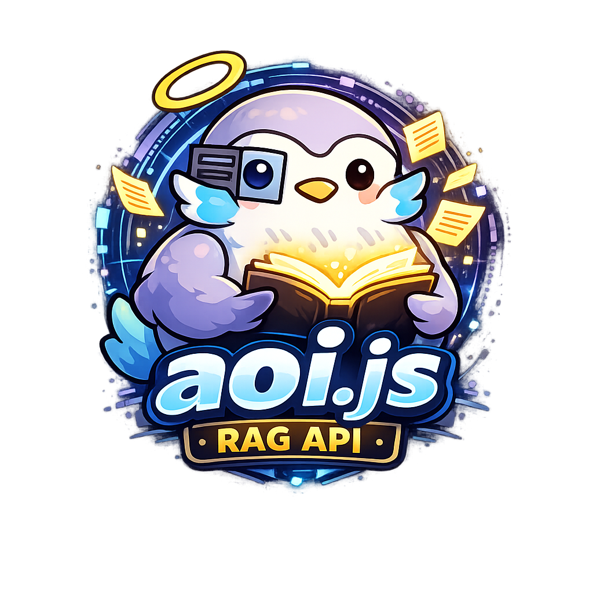

<p align="center">
  
</p>


# aoi.js RAG API


Doc-constrained Node.js API that answers aoi.js questions, generates strict minimal code, and validates aoi.js code using local documentation.

## Requirements
- Node.js >= 18.18
- Local docs at `website/` (read-only)
- `GEMINI_API_KEY` (embeddings)
- `MISTRAL_API_KEY` (generation)

## Setup

```zsh
cd aoi.api
cp .env.example .env
# set DOCS_PATH, GEMINI_API_KEY, MISTRAL_API_KEY
# set Discord OAuth: DISCORD_CLIENT_ID, DISCORD_CLIENT_SECRET, DISCORD_REDIRECT_URI
# set JWT secret: JWT_SECRET
npm install
```

## Ingest Documentation (one-time)

```zsh
npm run ingest
```

Reads Markdown/MDX under `DOCS_PATH`, chunks content, embeds with Gemini, and stores vectors in SQLite at `data/vectors.db`.

## Start API

```zsh
# Default port is 3333 (set PORT to override)
npm run dev
```

## Endpoints

`GET /api` — Index of endpoints
```zsh
curl -sS "http://localhost:${PORT:-3333}/api" | jq
```

`GET /api/basicQuery` — Minimal Q&A strictly from local docs; returns an answer and sources
- Query params:
  - `q` or `request` (required): your aoi.js question
  - `mode=code` (optional): return minimal code instead of text
```zsh
# Answer mode
curl -sS "http://localhost:${PORT:-3333}/api/basicQuery?q=How%20to%20add%20a%20button%3F&apikey=$APIKEY" | jq

# Code mode
curl -sS "http://localhost:${PORT:-3333}/api/basicQuery?request=Create%20a%20simple%20coin%20balance%20command&mode=code&apikey=$APIKEY" | jq
```

`GET /api/function` — Function reference from docs
- Query params:
  - `name` (required): function name without `$` (e.g., `addButton`)
```zsh
curl -sS "http://localhost:${PORT:-3333}/api/function?name=addButton&apikey=$APIKEY" | jq
```

`GET /api/generateStrict` — Strict aoi.js code generator from local docs only
- Query params:
  - `request` (required): user intent (e.g., "economy daily command")
  - `max_tokens` (optional): cap for generation
```zsh
curl -sS "http://localhost:${PORT:-3333}/api/generateStrict?request=Economy%20daily%20command&apikey=$APIKEY" | jq
```

`GET /api/validateAoi` — Validate aoi.js code (syntax, docs compliance, logic)
- Query params:
  - `code` (required): aoi.js code (fences allowed)
  - `request` (optional but recommended): intent (e.g., "diagnose" or "fix my code")
  - `mode` (optional): set to `fix` to request a deterministic simple repair when possible
```zsh
curl -sS "http://localhost:${PORT:-3333}/api/validateAoi" \
  --get \
  --data-urlencode 'request=diagnose my command' \
  --data-urlencode 'code=```js\n$if[$getUserVar[balance]>=100]\n$setUserVar[balance;$sub[$getUserVar[balance];100];$authorID]\n$else\n$sendMessage[Not enough balance;false]\n$endif\n```' \
  --data-urlencode "apikey=$APIKEY" | jq

# Request deterministic repair (adds missing $endif if needed)
curl -sS "http://localhost:${PORT:-3333}/api/validateAoi" \
  --get \
  --data-urlencode 'request=fix my flow' \
  --data-urlencode 'mode=fix' \
  --data-urlencode 'code=```aoi$if[$message==hi]$sendMessage[Hello;false]```' \
  --data-urlencode "apikey=$APIKEY" | jq
```

## Environment
- `DOCS_PATH`: root of local docs used for ingestion
- `PORT`: server port (default `3333`)
- `RATE_WINDOW_MS`, `RATE_MAX`: global rate limiting
- `TOP_K`, `CONTEXT_CHUNKS`, `SIMILARITY_THRESHOLD`: retrieval tuning
- `GEMINI_API_KEY`, `GEMINI_EMBED_MODEL`: embeddings (default `text-embedding-004`)
- `MISTRAL_API_KEY`, `MISTRAL_MODEL`, `MISTRAL_ENDPOINT`, `MISTRAL_TEMPERATURE`: generation
- `JWT_SECRET`: HS256 signing secret for session JWTs
- `SESSION_TTL_MS`: session lifetime (default 24h)
- `DISCORD_CLIENT_ID`, `DISCORD_CLIENT_SECRET`, `DISCORD_REDIRECT_URI`: Discord OAuth credentials
- `SQLITE_DB_PATH`: path for auth/session/key database (default `auth.db` in project root)

